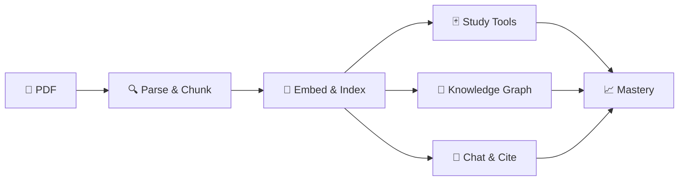

<div align="center">

<div style="font-size: 64px; line-height: 1;">📚</div>

# Bookify

### Where Technical Books Become Living Knowledge

**Turn any dense PDF textbook into an interactive, AI-powered study universe —**<br/>
*read, chat, practice, visualize, and master — all without leaving the page.*

<p>


</p>

<sub>Self-hosted • Single-user • Offline-first • OpenRouter / OpenAI compatible • 19 routers • 29 prompts • 40+ components</sub>

<br/>

[**✨ Features**](#features) &nbsp;•&nbsp; [**🏗 Architecture**](#architecture) &nbsp;•&nbsp; [**🚀 Quick Start**](#getting-started) &nbsp;•&nbsp; [**⚙️ Configuration**](#configuration) &nbsp;•&nbsp; [**📡 API**](#api-overview)

</div>

---

<div align="center">

> ### *Passive re-reading forgets. Active recall remembers.*
> **Bookify replaces highlighting with doing — every paragraph becomes a question, every concept a node, every code block a runnable cell.**

</div>

<table>
<tr>
<td align="center" width="33%">

### 📖 Read Smarter
Grounded RAG chat with<br/>page-level citations,<br/>8 in-reader AI actions

</td>
<td align="center" width="33%">

### 🧠 Remember Longer
SM-2 flashcards, adaptive<br/>quizzes, recall checks<br/>& spaced repetition

</td>
<td align="center" width="33%">

### 🌌 See Connections
3D knowledge universe<br/>+ cross-book clusters<br/>that link your library

</td>
</tr>
<tr>
<td align="center" width="33%">

### 💻 Practice In Place
Auto-extracted code →<br/>executable notebooks<br/>with matplotlib & vars

</td>
<td align="center" width="33%">

### 🎯 Master Adaptively
Knowledge Points +<br/>weak-area detection →<br/>personalized sessions

</td>
<td align="center" width="33%">

### 🏆 Stay Motivated
XP, levels, streaks,<br/>heatmaps & 16<br/>achievements

</td>
</tr>
</table>

<div align="center">



*From upload to mastery in minutes — not weeks.*

</div>

---

<div align="center">

### 🧭 Explore the Guide

| [💡 Why Bookify](#why-bookify) | [🧱 Tech Stack](#tech-stack) | [✨ Features](#features) | [🏗 Architecture](#architecture) |
|:---:|:---:|:---:|:---:|
| [📁 Project Structure](#project-structure) | [🚀 Quick Start](#getting-started) | [⚙️ Configuration](#configuration) | [📡 API Overview](#api-overview) |
| [🎨 Frontend](#frontend) | [🧪 Testing](#testing) | [⚠️ Limitations](#known-limitations) | [🔮 Roadmap](#roadmap) |

</div>

---

<a id="why-bookify"></a>
## 💡 Why Bookify — The Problem It Solves

<div align="center">

*You don't need another PDF reader. You need a system that makes knowledge stick.*

**Studies show passive re-reading retains < 20% after a week. Bookify is built on the science of learning — active recall, spaced repetition, elaboration, and transfer.**

</div>

<table>
<tr>
<th align="center" width="50%">❌ The Old Way</th>
<th align="center" width="50%">✅ The Bookify Way</th>
</tr>
<tr>
<td>

📄 Scroll a 600-page PDF<br/>
🔍 Ctrl+F and hope<br/>
🟨 Highlight and forget<br/>
🤷 Ask ChatGPT — no citations<br/>
📚 Books stay isolated<br/>
💤 Motivation fades

</td>
<td>

🗂️ **Structured** — PDF → chapter/section tree with page-accurate navigation<br/>
📌 **Grounded** — Every answer cites `page + section`; hybrid retrieval (book-first, web-augmented)<br/>
🧠 **Active recall** — Flashcards, quizzes, socratic dialog, teach-back & recall checks generated *from your book*<br/>
📊 **Mastery-tracked** — Knowledge Points + weighted mastery surface weak areas and drive what to study next<br/>
🔗 **Connected** — Cross-book links & clusters reveal how concepts transfer across your library<br/>
⚡ **Practice in place** — Code blocks auto-extracted and run in notebooks beside the text

</td>
</tr>
</table>

> <div align="center">
>
> **One upload. Six transformations. Zero context switching.**
>
> `PDF → Structure → Searchable Corpus → Study System → Knowledge Graph → Mastery`
>
> </div>

---

## 🧱 Tech Stack

<div align="center">

*Production-grade backend. Delightful frontend. Zero vendor lock-in.*

**Pick your LLM, pick your embeddings, keep your data.**

</div>

| Layer | Choice | Notes |
|-------|--------|-------|
| **Backend** | FastAPI `>=0.111`, Uvicorn | 19 routers under `/api`, SSE streaming, background ingest tasks |
| **ORM / DB** | SQLAlchemy 2.0, SQLite (WAL, `busy_timeout=60000`) | Auto-backups (keep 5), hand-rolled migrations in `backend/app/database.py:53` |
| **Vector store** | ChromaDB `>=0.5.5` | 3 collections: main corpus, code snippets, cross-book |
| **LLM** | LiteLLM `>=1.44` | OpenRouter / OpenAI-compatible via `backend/app/llm.py`; 29 prompt files in `backend/prompts/` |
| **Embeddings** | LiteLLM or local `all-MiniLM-L6-v2` | Configurable in `config.toml` (`[embeddings]`) |
| **PDF parsing** | PyMuPDF `>=1.24.9` | Text blocks, TOC, font-size analysis, code-font detection |
| **Search** | Tavily `>=0.8` + `ddgs` fallback | Query decomposition + relevance scoring |
| **Code execution** | `backend/app/kernel_manager.py` | One long-lived `python -I -u` subprocess per notebook, base64 JSON over stdio, matplotlib capture, 5 s timeout, blocklist filter |
| **TTS** | `edge-tts` + Piper / VoiceTutTTS for Arabic | `backend/app/routers/tts.py` |
| **Frontend** | React 18.3, React Router 6.26, Vite 5, TS 5.5, Tailwind 3.4 | Lazy-loaded pages, `manualChunks` for vendor splitting |
| **3D / 2D graphs** | `three` + `react-force-graph-3d` / `react-force-graph-2d` | Per-book 3D universe + unified 2D canvas map |
| **PDF viewer** | `pdfjs-dist` | In-reader rendering |
| **Code editor** | `@uiw/react-codemirror` + `@codemirror/lang-python` | Notebook cell editing |
| **Markdown / math** | `react-markdown` + `remark-gfm` + `remark-math` + `rehype-katex` + `katex` | Answers, summaries, notes |

---

<a id="features"></a>
## ✨ Features — Every Page, Supercharged

<div align="center">

*Everything that turns reading into **doing**. Each feature is grounded in your book's own text — never generic.*

</div>

### 1. 📚 Library & Ingestion

- **Upload** a PDF → stored under `data/uploads/<uuid>.pdf`, `Book` row created with `status="pending"`, ingest runs as a `BackgroundTasks` job (`backend/app/routers/books.py:101`).
- **Parsing** (`backend/app/parser.py`): `fitz.open` → `doc.get_toc(simple=True)` + `page.get_text("dict")` span analysis. Each block is typed `heading | body | code`:
  - dominant body font size is the weighted mode over body spans (`parser.py:43`);
  - a block is `code` if its font family hints contain `mono/courier/consolas/menlo/cmtt/dejavusansmono` (`parser.py:8`);
  - otherwise `heading` if `size >= body_size * min_heading_ratio (1.15)` and `len(text) <= 200` (`parser.py:88`).
  - Title is chosen by priority: PDF metadata → filename → first `level==1` TOC entry → file stem, with hash-like title filtering (`parser.py:34`).
- **Sectioning** (`backend/app/chunker.py:121`):
  - If a clean TOC exists (levels `1..max_toc_level`, monotonic pages, deduped), it becomes `SectionDraft`s directly.
  - If the TOC is flat (single level), `_derive_subtitles` finds a dominant subtitle tier at `1.5×–2.4×` body size, caps at 40 subs per chapter, drops recurring decorative labels, and nests them (`chunker.py:61`).
  - If no TOC, fallback is typographic headings from blocks; if still empty, a single pseudo-section from the book title.
  - Parent hierarchy is reconstructed from `level` and `parent_id` on persist (`backend/app/ingest.py:97`).
- **Front-matter filtering** (`backend/app/chunker.py:34` + `backend/app/config.py:39`):
  - `front_matter_blacklist` (23 entries: `front matter, title page, half title, copyright, table of contents, contents, dedication, epigraph, disclaimer, preface, foreword, introduction, about the author, …, publisher, notation, glossary`) — any section whose normalized title equals or contains a blacklisted phrase is considered front matter.
  - `detect_content_start_index` returns the first non-blacklisted section. **User decision:** `Introduction` is treated as front matter; `Introduction to Reinforcement Learning / Introduction to Agentic AI` (titles *containing* the word but not equal) are real content when they appear after the boundary.
  - `make_chunks(parsed, content_start_page)` (`chunker.py:258`) returns `(sections, chunk_drafts, content_start_index)`; only drafts with `idx >= content_start_index` are persisted, so front matter never pollutes the corpus.
- **Chunking** (`chunker.py:177`): `_split_long` prefers `\n` then `. ` boundaries; `pack_section_chunks` packs units to `chunk_chars=1400` with `overlap=200`, preserving `is_code` per block and propagating page ranges. Ordinal `ord` is global across the book.
- **Persistence** (`backend/app/ingest.py`): sections → `Section` rows (with `page_end` computed from next `page_start`), chunks → `Chunk` rows with embeddings + Chroma upsert (`backend/app/vectorstore.py`), code snippets also indexed to the code collection. Cover is extracted from page 1 as PNG. Book status flips to `ready`; `Book.content_start_section_id` and `Book.content_start_page` are set.
- **Content-start override** (`backend/app/routers/books.py:202`): `GET /api/books/{id}/content-start` lists sections with current boundary; `POST /api/books/{id}/content-start` stores `content_start_page` (stable across reindex) and triggers a guarded reindex. `make_chunks` honors the override exactly when a section with that `page_start` exists.
- **Reindex & delete** (`books.py:141`): Reindex deletes vectors (main + code), flashcards, quizzes, summaries, code blocks, knowledge points/edges/cross-links, nulls `Note.section_id`, sets `status=pending`, then re-ingests in background — all under `PRAGMA foreign_keys=OFF`. Both `reindex` and `set_content_start` share `_guard_no_other_indexing` (`books.py:33`), returning `409` if any other book is `pending` (prevents SQLite write races).
- **Dashboard** (`books.py:44`): `GET /api/books/dashboard` aggregates due/mastered cards, notes, section progress, and last quiz per book.

### 2. 💬 Agentic RAG Chat

- **Sessions** (`backend/app/routers/chat.py`): book-scoped `ChatSession`s with configurable history window (`settings.llm.max_history_messages = 10`). Messages stream via SSE; cancellation via `AbortSignal`.
- **Retrieval** (`backend/app/rag.py:16`): `embedding_client.embed_query` → `store.query(top_k=6)` → labeled context `[Excerpt i | Section: … | pages …]` plus a separate code query (`top_k=3`). Best distance is the minimum hit distance.
- **Web fallback** (`rag.py:51` + `backend/app/websearch.py`): If `best_distance is None` or `> web_fallback_distance (0.6)` (`config.toml:20`), `augment_with_web` runs. `websearch.search_web` optionally decomposes the query via `prompts/query_decompose.txt`, searches **Tavily** (primary) then **DDGS** (fallback), and relevance-filters with `prompts/relevance_score.txt`. Web hits append `[Web result i | Source: … | URL: … | Relevance: …]` and page-less citations (`page=None, url=…`).
- **Prompting** (`rag.py:70`): `prompts/chat_system.txt` as system prompt, plus an optional `reader_notes_block` (15 most-recent notes, capped at 1600 chars, introduced as *"your note"* rather than book content) (`rag.py:85`). Book context + history + question form the messages.
- **Streaming** (`backend/app/llm.py`): `llm_client.stream(messages)` yields `content | reasoning | status` events; `chat.py:118` retries `MAX_STREAM_ATTEMPTS=3` on `litellm.RateLimitError` with linear backoff (5 s × attempt). Titling (`POST /api/sessions/{id}/title`) names the session from the first Q/A via a 3–6 word prompt, idempotently.

### 3. 🧠 Knowledge Points & Mastery

- **Extraction** (`backend/app/routers/intelligence.py`): LLM + `prompts/knowledge_points.txt` over sampled section chunks, up to 12 per section (force/skip-if-exists). Stored as `KnowledgePoint(book_id, section_id, name, description, difficulty)`.
- **Mastery model** (`models.py:203` `UserKnowledgePoint`): per-KP fields `quiz_correct/quiz_total`, `socratic_reveals/socratic_total`, `practice_score_sum/practice_count`, `mastery ∈ [0,1]`, `last_practiced`. Updated by quiz grading, socratic reports, and practice scoring via `update_mastery`.
- **Weak areas** (`GET /api/books/{id}/weak-areas`): lowest-mastery KPs with section titles and recommendations rendered in `frontend/src/components/WeakAreasPanel.tsx`.

### 4. 🌌 Knowledge Graphs

- **Per-book universe (3D)** — `backend/app/routers/conceptmap.py` + `frontend/src/components/ConceptGraph.tsx`:
  - Nodes = `KnowledgePoint`s; edges = `ConceptEdge(source_point_id, target_point_id, relationship_type, strength)` extracted via `prompts/concept_edges.txt` (force/idempotent).
  - 3D force graph (`react-force-graph-3d` + `three`) is the immersive per-book universe; node color/size encode mastery/difficulty.
- **Unified cross-book map (2D)** — `backend/app/routers/crossbook.py` + `frontend/src/pages/KnowledgeMapPage.tsx`:
  - `GET /api/cross-book/unified-graph` merges all books into a single canvas (`react-force-graph-2d`); clusters and cross-book links overlaid.
  - `GET /api/books/{id}/concept-graph/{kp_id}` drills into a single KP.

### 5. 🔗 Cross-Book Links, Clusters & Related Sections

- **Links** (`backend/app/routers/crossbook.py`): `CrossBookLink(source_kp_id, target_kp_id, similarity, relationship_label, explanation)` — created by embedding similarity + `prompts/cross_book_link.txt`, listing via `GET /api/cross-book/links`, extraction via `POST /api/cross-book/extract`.
- **Clusters** (`ConceptCluster` + `ConceptClusterMember`): named groups of KPs spanning multiple books, via embeddings + `cluster_naming.txt`.
- **Related sections** (`GET /api/cross-book/related/{bookId}/{sectionId}`): shared clusters + similarity scores, surfaced in `frontend/src/components/RelatedSections.tsx` inside the reader.

### 6. 🃏 Study Tools

- **Section summaries** (`backend/app/routers/study.py:148`): length auto-scales with total characters (`70–420` words, `CHARS_PER_SUMMARY_WORD=160`). Up to 30 chunks evenly spread across descendants, excerpts via `prompts/summary.txt`, streaming response, cached in `SectionSummary` and re-streamed when `force=false` without calling the model.
- **Flashcards** (`study.py:197`):
  - Generation via `prompts/flashcards.txt` (4–24 cards, `CHARS_PER_FLASHCARD=4000`), spread 24 chunks, JSON-array parsed, existing cards for the section replaced. Single-card creation (`POST …/flashcards/single`) awards XP.
  - **Review** is a simplified SM-2 (`study.py:271`): `again | hard | good | easy` adjust `ease (floor 1.3)`, `interval_days`, `reps/lapses`, `due_at` (again → +10 min; otherwise days). `GET /api/books/{id}/review?limit=30` returns due cards; `POST …/flashcards/{id}/review` applies and awards `flashcard_review (5 XP)` or `flashcard_perfect (10 XP)`.
- **Quizzes** (`study.py:402`):
  - Scope-aware (section subtree vs whole book), 3–15 questions (`CHARS_PER_QUESTION=7000`), 30/40 chunk window, `prompts/quiz.txt` → in-memory `_quizzes` dict (cap 50, LRU-evicted).
  - `POST /api/quiz/{quizId}/grade` checks `answer_index`, logs a `QuizError` row on miss, returns `{correct, answer_index, explanation}`.
  - `POST /api/books/{id}/quiz-attempts` persists aggregates and calls `intelligence.update_mastery` per `knowledge_point_results`; perfect vs attempt award `quiz_perfect (50 XP)` vs `quiz_attempt (20 XP)`. Progress/attempt history via `GET /api/books/{id}/progress`.
  - An **Error Journal** (`frontend/src/components/ErrorJournal.tsx` + `GET /api/books/{id}/errors?limit=30`) collects recent misses (`QuizError`).

### 7. 🎓 Active Learning

All under `backend/app/routers/learning.py` (streaming where applicable, reportable for mastery/XP):

- **Socratic tutoring** (`prompts/socratic.txt`): guided questioning that avoids direct answers; reveal-level reported via `POST /api/books/{id}/intelligence/report` (tracks `socratic_reveals/socratic_total`).
- **Teach-back** (`prompts/teachback_questions.txt` → questions, `prompts/teachback_chat.txt` → interactive chat; optional TTS + browser speech recognition). Awards `teachback_complete (30 XP)`.
- **Understanding check** (`prompts/understanding_check.txt`): generates focus questions then analyzes gaps/misconceptions into a study plan (`frontend/src/components/UnderstandingCheck.tsx`).
- **Practice problems** (`prompts/practice.txt`): `problem_type`-aware generation with `hints + solution`.
- **Recall check** (`prompts/recall_check.txt` via `backend/app/routers/progress.py`): free-text recall scored for accurate/missed points and misconceptions (`frontend/src/components/RecallPrompt.tsx`).

### 8. 🗓️ Adaptive Study Sessions

- `backend/app/routers/session.py` (`StudySession` + `StudyActivity`): `POST /api/books/{id}/study-sessions/start` builds a mixed plan (review cards, weak KPs, unread sections, practice) ordered by mastery and due dates; the frontend walks `current_index → total`, reporting `result + duration_seconds` per activity (`POST …/next`). `POST …/complete` finalizes, awards session XP, updates streaks and mastery. Rendered in `frontend/src/components/StudySessionView.tsx`.

### 9. 📖 Reader

- **PDF viewer** (`frontend/src/components/PdfViewer.tsx`, `pdfjs-dist`): page navigation, zoom, text selection with a `SelectionToolbar`.
- **Section chat** (`backend/app/routers/read.py` + `frontend/src/components/SectionChatPanel.tsx`): section-scoped SSE chat (mirrors main chat pipeline but anchored to a single section + page; optional `section_id/page` context).
- **8 in-reader actions** (`frontend/src/components/SelectionToolbar.tsx` → `backend/app/routers/read.py` + prompts):
  | Action | Prompt | Side effect |
  |--------|--------|-------------|
  | `simplify` | `read_simplify.txt` | streams plain-language rewrite |
  | `explain` | `read_explain.txt` | streams detailed explanation |
  | `examples` | `read_examples.txt` | streams examples/analogies |
  | `code` | `read_code.txt` → `read_code_cell.txt` | generates a runnable notebook cell |
  | `create_flashcard` | `read_flashcard.txt` | creates a `Flashcard` |
  | `create_note` | `read_note.txt` | creates a `Note` |
  | `ask` | delegated to section chat | free-form Q via `question` field |
  | `translate` | `read_translate.txt` / `read_translate_words.txt` | bilingual EN↔AR per-word list → `VocabWord` rows |
- **Notes** (`backend/app/routers/notes.py`): CRUD `Note(book_id, section_id?, page?, quote?, content)`, 15 most-recent injected into chat system prompt.
- **Translate & vocab** (`backend/app/routers/vocab.py`): `POST /api/books/{id}/vocab/translate` returns `TranslateResult{words[], context}`, `POST …/vocab` / `POST …/vocab/batch` persist `VocabWord`s; `frontend/src/components/TranslatePopup.tsx` + `VocabPanel.tsx`.
- **Progress** (`backend/app/routers/progress.py`): `ReadingProgress(section_id, completed_at, time_spent_seconds)` toggling, `ReadingSummary{sections_read, total_sections, chapter_progress}`, `BookDashboard` aggregation; `RecallPrompt` inline.

### 10. 💻 Notebooks & Code

- **Extraction** (`backend/app/routers/notebook.py`): `prompts/code_blocks.txt` scans sections for copy-pasteable Python samples, stored as `CodeBlock(book_id, section_id, language, code, description)`. Browse in `frontend/src/components/CodeLibraryPanel.tsx`; bulk-extract idempotently with `force`.
- **Notebooks** (`Notebook` + `NotebookCell`): one book-level + optional per-section notebooks, shared cell model (`cell_type: code|markdown`, `images`, `variables`, `execution_count`, `elapsed_ms`, `last_executed_at`). CRUD, move/duplicate, run single / run above / run below / run all, restart, reset.
- **Execution** (`backend/app/kernel_manager.py:129`): `KernelManager` keeps one daemon `python -I -u -c <worker>` subprocess per `notebook_id`. Cell source is base64-JSON-framed over stdin; stdout/stderr redirected, matplotlib figures captured to base64 PNGs (Agg backend), variables summarized via truncated `repr`. Safety blocklist (`kernel_manager.py:12`) rejects `os.system`, `subprocess`, `eval/exec`, `__import__/importlib/ctypes/socket/requests/urllib`, dunder tricks, `getattr/setattr`, `input`, etc. Timeout is `CELL_TIMEOUT_SECONDS (5 s) + 10 s` sentinel; on timeout the kernel is killed and auto-restarts with `restarted: true`.
- **Playground** (`backend/app/routers/playground.py`): ephemeral notebook without a book, same kernel path, for quick experimentation.

### 11. 🏆 Gamification & Stats

- **XP engine** (`backend/app/xp_engine.py:20`):
  ```
  flashcard_review 5 | flashcard_perfect 10 | quiz_attempt 20 | quiz_perfect 50
  note_created 10 | socratic_complete 25 | practice_complete 20 | teachback_complete 30
  understand_complete 15 | study_session_complete 15 | daily_goal_met 40
  section_read 15 | cross_book_discovery 25
  ```
  Level thresholds: `xp_for_level(L) = 100*L*(L+1)/2` (`xp_engine.py:56`), `level_for_xp` walks levels from 1.
- **Profile & daily progress** (`UserProfile`, `DailyProgress`, `StudyStreakLog`): `_ensure_profile`, `_ensure_daily_progress`, `_update_streak` handle streaks (today vs last_study_date; +1 on consecutive day, reset on gap). `StudyStreakLog` logs per-day activities/XP. Daily goal bonus triggers once when `xp_earned >= daily_xp_goal` (`xp_engine.py:191`).
- **Achievements** (`AchievementDefinition` seeded via `seed_achievements` + `UserAchievement`, catalog of 16 in `xp_engine.py:36`): `first_quiz_ace`, `quiz_master_10`, streaks `3/7/30/100`, book exploration `2/5/10`, cards `50/500`, mastery `first/10`, `notes_25`, levels `5/10`. New achievements checked on every `award_xp` and award bonus XP.
- **Frontend** (`frontend/src/pages/StatsPage.tsx` + `frontend/src/components/GamificationBar.tsx`, `CalendarHeatmap.tsx`, `AchievementGrid.tsx`, `MasteryLeaderboard.tsx`, `StudyStreakPanel.tsx`): heatmap of daily XP, category-filtered achievement grid, leaderboard by mastery, streak panel.

### 12. 🔎 Search

- `backend/app/routers/search.py`: `GET /api/search?q=&k=12` embeds the query, runs semantic Chroma search and an enhanced RRF fusion across hits, returning `SearchHit{book_id, book_title, section_id, section_title, page_start, snippet, distance}`. Frontend via `LibraryPage`.

### 13. 🔊 TTS

- `backend/app/routers/tts.py`: `POST /api/tts {text, lang, quality}` — streams audio via `edge-tts` (EN) / `Piper` or `VoiceTutTTS` (AR), with `lang=ar|en` and `quality=fast|high` to balance latency vs naturalness.

### 14. ⚙️ Settings (Runtime Config)

- `backend/app/routers/settings.py`: `GET /api/settings` / `PUT /api/settings` read + hot-reload `Settings` from `config.toml` via masked keys (`tavily_api_key_masked`, `openrouter_api_key_masked`). Changes to `llm.model`, `embeddings.provider`, `ingestion.*`, `chat.web_fallback_distance`, `web_search.*` take effect without restart (`frontend/src/pages/SettingsPage.tsx`).

### 15. 📤 Export

- `backend/app/routers/export.py`: `GET /api/books/{id}/export/anki` (CSV with `front,back,section,page`) and Markdown notes export for external study tools.

---

<a id="architecture"></a>
## 🏗 Architecture — How the Magic Works

<div align="center">

*From raw PDF to mastery — a pipeline that respects your book's structure, not just its text.*

</div>

### 🔄 Ingestion & Retrieval Pipeline

```
PDF upload
  └─► parse_pdf (PyMuPDF blocks + TOC)         backend/app/parser.py
        └─► build_sections + _derive_subtitles   backend/app/chunker.py
              └─► detect_content_start_index      blacklist-filtered first-chapter detection
                    └─► make_chunks               is_code-preserving, 1400/200 pack
                          └─► SQLite Sections/Chunks + Chroma (main + code) + CodeBlocks/Cover
                                └─► ingest_book marks Book.ready
                                    └─► retrieve_context (top_k 6 + 3 code)  backend/app/rag.py
                                          └─► augment_with_web if weak match  backend/app/websearch.py
                                                └─► llm_client.stream → SSE  backend/app/llm.py
```

### 🗃️ Data Model (core of `backend/app/models.py`)

| Table | Key fields |
|-------|------------|
| `Book` | `title, filename, path, cover_path, num_pages, status, error, content_start_section_id, content_start_page, created_at` |
| `Section` | `book_id, parent_id, title, level, page_start, page_end, ord`; self-referential hierarchy |
| `Chunk` | `book_id, section_id, section_title, text, page_start, page_end, ord, is_code` |
| `ReadingProgress` | `section_id (unique), completed_at, time_spent_seconds` |
| `ChatSession / Message` | sessions per book (+ optional `section_id`); messages carry `action`, `citations_json` |
| `SectionSummary` | `book_id, section_id (unique), content` |
| `Flashcard` | SM-2 fields: `ease, interval_days, due_at, reps, lapses` |
| `QuizAttempt / QuizError` | score/total + per-error `question/user_answer/correct_answer/explanation` |
| `Note / VocabWord` | linked to `book/section/page`, quote+content |
| `KnowledgePoint / UserKnowledgePoint / ConceptEdge` | per-section concepts + weighted mastery + graph edges |
| `StudySession / StudyActivity` | adaptive plan: activities typed, timed, KP-linked |
| `CodeBlock` | extracted Python samples per section |
| `Notebook / NotebookCell` | book- or section-scoped notebooks; cells carry `output/error/images/variables` |
| `UserProfile / DailyProgress / StudyStreakLog / AchievementDefinition / UserAchievement` | gamification |
| `CrossBookLink / ConceptCluster / ConceptClusterMember` | inter-book graph |

### 🧩 Module Map (`backend/app/`)

| File | Role |
|------|------|
| `main.py:15` | `FastAPI` lifespan (`ensure_dirs`, `init_db`, `kernel_manager.shutdown`), CORS `5173`, 19 routers |
| `config.py` | `Settings` dataclasses, `config.toml` + `.env` merge (Tavily key `config.toml > .env > empty`), `ensure_dirs` |
| `database.py` | `create_engine(sqlite:///…)` with `WAL` + `busy_timeout=60000` + `foreign_keys=ON`, `Base`, `init_db` (hand-rolled `ALTER TABLE` migrations + WAL backup to 5 copies), `SessionLocal`, `get_db` |
| `parser.py` | `parse_pdf`, `extract_blocks`, `is_hashlike_title`, `_dominant_font_size` |
| `chunker.py` | `make_chunks`, `build_sections`, `detect_content_start_index`, `pack_section_chunks`, `_derive_subtitles` |
| `ingest.py` | `ingest_book`, `extract_cover`, parent-stack reconstruction, vector upsert |
| `vectorstore.py` | `get_vector_store` (3 Chroma collections), `query`, `query_code` |
| `embeddings.py` | `embedding_client.embed_query / embed_documents` (LiteLLM / local) |
| `llm.py` | `llm_client.stream / complete` (LiteLLM OpenRouter/OpenAI-compatible) |
| `rag.py` | `retrieve_context`, `augment_with_web`, `build_chat_messages`, `reader_notes_block` |
| `websearch.py` | `search_web` (Tavily + DDGS, decomposition, relevance filter) |
| `kernel_manager.py` | `KernelManager` (per-notebook subprocess, blocklist, timeout, image/var capture) |
| `xp_engine.py` | `award_xp`, `level_for_xp`, `seed_achievements`, `_check_achievements`, `_update_streak` |

### 💬 Prompts (`backend/prompts/`, 29 files)

`chat_system`, `summary`, `flashcards`, `quiz`, `knowledge_points`, `concept_edges`, `cross_book_link`, `cluster_naming`, `related_sections`, `query_decompose`, `relevance_score`, `socratic`, `teachback` + `teachback_questions` + `teachback_chat` + `teachback_evaluate`, `understanding_check`, `practice`, `recall_check`, `code_blocks`, `read_simplify`, `read_explain`, `read_examples`, `read_code` + `read_code_cell`, `read_flashcard`, `read_note`, `read_translate` + `read_translate_words`.

System prompts are read from disk and templated via `{key}` substitution (`study.py:128`, `rag.py:70`).

---

## 📁 Project Structure

```
D:\bookify\
├── Dockerfile                  # multi-stage single image: node → python + nginx + Vite build
├── docker-compose.yml          # one service on 8080:80 + named volume bookify-data:/app/data
├── nginx.conf                  # SPA fallback + /api → 127.0.0.1:8000 (SSE-friendly)
├── entrypoint.sh               # starts uvicorn then nginx (tini as PID 1)
├── .dockerignore               # keeps data/.venv/node_modules/models out of the image
├── config.toml                 # LLM, embeddings, ingestion, chat, web_search, data paths
├── .env / .env.example         # OPENROUTER_API_KEY, TAVILY_API_KEY, …
├── CLAUDE.md                   # contributor behavioral guidelines
├── data/                       # ← named volume in Docker, local folder in manual mode
│   ├── bookify.db              # SQLite (WAL) — auto-backups bookify.db.bak-*
│   ├── chroma/                 # Chroma collections
│   └── uploads/                # per-upload PDFs + cover PNGs
├── backend/
│   ├── requirements.txt        # now includes edge-tts (fix for tts.py:7 import)
│   ├── prompts/                # 29 prompt files (*.txt)
│   ├── tests/
│   │   └── test_ingestion.py   # pdf structure + chunking tests
│   └── app/
│       ├── main.py, config.py, database.py, models.py, schemas.py
│       ├── parser.py, chunker.py, ingest.py, vectorstore.py, embeddings.py, llm.py, rag.py, websearch.py
│       ├── kernel_manager.py, xp_engine.py
│       └── routers/
│           ├── books.py, chat.py, study.py, notes.py, search.py, export.py, settings.py
│           ├── learning.py, intelligence.py, session.py, tts.py, conceptmap.py, playground.py
│           ├── notebook.py, gamification.py, crossbook.py, progress.py, read.py, vocab.py
├── frontend/
│   ├── package.json, vite.config.ts, tailwind.config.js
│   └── src/
│       ├── main.tsx, App.tsx, AppShell.tsx, api.ts, types.ts
│       ├── pages/              # LibraryPage, BookPage, KnowledgeMapPage, SettingsPage, StatsPage
│       ├── components/         # PdfViewer, ConceptGraph, Notebook, StudyView, ReadView, SocraticChat,
│       │                       # TeachBack, UnderstandingCheck, PracticeProblems, RecallPrompt,
│       │                       # WeakAreasPanel, StudySessionView, + gamification/reader/markdown/ui
│       └── hooks/              # usePaneWidth, etc.
```

---

<a id="getting-started"></a>
## 🚀 Getting Started — From Zero to Studying in 3 Minutes

<div align="center">

*One command with Docker — or the full manual setup. Your books stay yours.*

</div>

### 🐳 Option A — Docker (recommended for trying it locally)

> **Fastest path for others to try Bookify.** Single image (`nginx + uvicorn`), one external port, persistent volume.

**Prerequisites:** [Docker Desktop](https://docs.docker.com/get-docker/) (includes `docker compose`).

**1. Configure keys**

```powershell
# D:\bookify
Copy-Item .env.example .env   # then edit .env
notepad .env
```

```ini
# D:\bookify\.env
OPENROUTER_API_KEY=sk-or-...
# or OPENAI_API_KEY=sk-...
TAVILY_API_KEY=tvly-...    # optional: better web search; without it DDGS fallback is used
```

> `config.toml` ships with sane defaults (model `openrouter/minimax/minimax-m3:free`, `chroma_default` offline embeddings, `data/` paths). Override it by editing `config.toml` or mounting one: see `docker-compose.yml`.

**2. Run**

```powershell
# build the frontend + backend into one image and start it
docker compose up --build -d

# watch logs
docker compose logs -f

# open the app
start http://localhost:8080
```

That's it — the SPA is served by **nginx** on `:8080`, which proxies `/api` → the FastAPI backend on `127.0.0.1:8000` inside the container (same-origin, no CORS issues, SSE streaming supported). Health is at `http://localhost:8080/health`.

**Manual `docker run` (without compose):**

```powershell
docker build -t bookify .
docker run -d --name bookify -p 8080:80 --env-file .env -v bookify-data:/app/data bookify
```

**Data persistence:** a named volume `bookify-data` is mounted at `/app/data` and holds `bookify.db` (SQLite WAL), `chroma/` vectors, and `uploads/` PDFs across restarts. Remove it with `docker volume rm bookify-data` to start fresh.

**Updating:**

```powershell
docker compose build --no-cache
docker compose up -d
```

**Optional — Arabic TTS:** the base image ships English TTS (`edge-tts`). Arabic TTS needs `backend/models/piper_ar/*.onnx` (~170 MB) + `piper`/`voicetut_tts` extras which are excluded by default. Mount them when needed:

```yaml
# docker-compose.yml volumes (uncomment & adjust)
# - ./backend/models:/app/backend/models:ro
```

---

### 🛠️ Option B — Manual (local dev)

**Prerequisites:**

- Python 3.11+ and a virtualenv
- Node 20+ and npm
- An LLM key: **OpenRouter** (recommended) or **OpenAI** (`config.toml:2` defaults to `openrouter/minimax/minimax-m3:free`)
- (Optional) A **Tavily** key for superior web search; otherwise `ddgs` is the fallback (`backend/requirements.txt:12`)

> **Windows note:** PowerShell blocks `npm.ps1` by default on this workspace — always use `npm.cmd` / `npx.cmd`.

#### 1. Configure

```toml
# config.toml — overrides defaults at D:\bookify\config.toml
[llm]
model = "openrouter/minimax/minimax-m3:free"
api_key_env = "OPENROUTER_API_KEY"
max_history_messages = 10

[embeddings]
provider = "chroma_default"          # or "litellm" / "local"
model = "openai/text-embedding-3-small"
local_model = "all-MiniLM-L6-v2"
batch_size = 32

[ingestion]
chunk_chars = 1400
chunk_overlap = 200
top_k = 6
min_heading_ratio = 1.15
max_toc_level = 2

[chat]
web_fallback_distance = 0.6
web_max_results = 4

[web_search]
provider = "tavily"
search_depth = "basic"
max_results = 5
query_expansion = true
relevance_filter = true

[data]
db_path = "data/bookify.db"
chroma_dir = "data/chroma"
uploads_dir = "data/uploads"
```

```ini
# D:\bookify\.env  (see .env.example)
OPENROUTER_API_KEY=sk-or-...
# or OPENAI_API_KEY=sk-...
TAVILY_API_KEY=tvly-...    # precedence: config.toml tavily_api_key > .env TAVILY_API_KEY > empty
```

#### 2. Backend

```powershell
# D:\bookify\backend
python -m venv ..\.venv
..\.venv\Scripts\python.exe -m pip install -r requirements.txt
..\.venv\Scripts\python.exe -m uvicorn app.main:app --host 127.0.0.1 --port 8000

# verify
Invoke-WebRequest http://127.0.0.1:8000/health
Get-NetTCPConnection -LocalPort 8000 -State Listen
```

> Any code change under `backend/app/` requires a **restart** — database migrations and Chroma handles are initialized at `lifespan` startup (`main.py:15`). A reliable detached launch on this machine is the `Win32_Process.Create` / `cmd /c "… > data\uv_out.log 2> data\uv_err.log"` pattern (see `data/uv_out.log` + `data/uv_err.log`).

#### 3. Frontend

```powershell
# D:\bookify\frontend
npm.cmd install
npm.cmd run dev        # Vite at http://127.0.0.1:5173, proxies /api → :8000 (vite.config.ts:8)
npm.cmd run build      # runs tsc -p tsconfig.app.json && tsc -p tsconfig.node.json && vite build
npx.cmd tsc -p tsconfig.app.json --noEmit   # type-check without build (exit 0 = clean)
```

#### 4. First upload

Open `http://127.0.0.1:5173` (manual) or `http://localhost:8080` (Docker), drop a technical PDF onto **Library**, wait for `ready`. Use the **First chapter** control in `StudyView` if front matter wasn't auto-skipped correctly — it triggers a manual content-start override + reindex.

---

## ⚙️ Configuration

<div align="center">

*One `config.toml`. One `.env`. Hot-reload without restart.*

</div>

All values in `backend/app/config.py`:

| Section | Key | Default | Source |
|---------|-----|---------|--------|
| `llm` | `model` | `openai/gpt-4o-mini` (code) / `openrouter/minimax/minimax-m3:free` (shipped `config.toml`) | `config.toml [llm]` |
| `llm` | `api_key_env` | `OPENROUTER_API_KEY` | `config.toml` → `os.environ[api_key_env]` |
| `llm` | `max_history_messages` | `10` | `config.toml` |
| `embeddings` | `provider` | `litellm` | `config.toml` |
| `embeddings` | `model` | `openai/text-embedding-3-small` | `config.toml` |
| `embeddings` | `local_model` | `all-MiniLM-L6-v2` | `config.toml` |
| `embeddings` | `batch_size` | `32` | `config.toml` |
| `ingestion` | `chunk_chars` | `1400` | `config.toml` |
| `ingestion` | `chunk_overlap` | `200` | `config.toml` |
| `ingestion` | `top_k` | `6` | `config.toml` |
| `ingestion` | `min_heading_ratio` | `1.15` | `config.toml` |
| `ingestion` | `max_toc_level` | `2` | `config.toml` |
| `ingestion` | `front_matter_blacklist` | 23 phrases (see Features → Ingestion) | `backend/app/config.py:39` |
| `chat` | `web_fallback_distance` | `0.6` | `config.toml` |
| `chat` | `web_max_results` | `4` | `config.toml` |
| `web_search` | `provider` | `tavily` | `config.toml` |
| `web_search` | `search_depth` | `basic` | `config.toml` |
| `web_search` | `max_results` | `5` | `config.toml` |
| `web_search` | `query_expansion` | `true` | `config.toml` |
| `web_search` | `relevance_filter` | `true` | `config.toml` |
| `web_search` | `tavily_api_key` | `""` → falls back to `TAVILY_API_KEY` env | `config.py:111` |
| `data` | `db_path` | `data/bookify.db` | `config.toml` |
| `data` | `chroma_dir` | `data/chroma` | `config.toml` |
| `data` | `uploads_dir` | `data/uploads` | `config.toml` |

All paths are resolved relative to the repo root (`ROOT_DIR`). `Settings` can be hot-reloaded via `PUT /api/settings` (no restart).

---

## 📡 API Overview

<div align="center">

*19 routers. Consistent SSE streaming. Single `/api` prefix.*

</div>

All book/note/search/study/etc routes are under `/api` (`main.py:32`); `notebook.py` mounts at `""` (`/api/notebooks/…` + `/api/books/…/notebook`); health at `GET /health`.

| Router (`backend/app/routers/*.py`) | Prefix | Endpoints |
|---------|--------|-----------|
| `books.py` | `/books` | `POST /api/books` (upload), `GET /api/books`, `GET /api/books/dashboard`, `GET /api/books/{id}`, `GET /api/books/{id}/sections`, `POST /api/books/{id}/reindex`, `DELETE /api/books/{id}`, `GET /api/books/{id}/content-start`, `POST /api/books/{id}/content-start`, `GET /api/books/{id}/pdf`, `GET /api/books/{id}/cover` |
| `chat.py` | — | `POST /api/books/{book_id}/sessions`, `GET /api/books/{book_id}/sessions`, `DELETE /api/sessions/{id}`, `GET /api/sessions/{id}/messages`, `POST /api/sessions/{id}/messages` (SSE), `POST /api/sessions/{id}/title` |
| `study.py` | — | `POST /api/books/{id}/sections/{sid}/summary` (SSE, cached), `GET /api/books/{id}/flashcards`, `POST /api/books/{id}/sections/{sid}/flashcards`, `POST /api/books/{id}/sections/{sid}/flashcards/single`, `GET /api/books/{id}/review`, `POST /api/books/{id}/flashcards/{cid}/review`, `POST /api/books/{id}/quiz-attempts`, `GET /api/books/{id}/progress`, `POST /api/books/{id}/quiz`, `POST /api/quiz/{qid}/grade` |
| `notes.py` | — | `GET /api/books/{id}/notes`, `POST /api/books/{id}/notes`, `PATCH /api/books/{id}/notes/{nid}`, `DELETE /api/books/{id}/notes/{nid}` |
| `search.py` | — | `GET /api/search?q=&k=` |
| `export.py` | — | `GET /api/books/{id}/export/anki`, `GET /api/books/{id}/export/notes` |
| `settings.py` | — | `GET /api/settings`, `PUT /api/settings` |
| `learning.py` | — | `POST /api/books/{id}/socratic`, `POST /api/books/{id}/practice/generate`, `POST /api/books/{id}/teachback/questions`, `POST /api/books/{id}/teachback/chat` (SSE), `POST /api/books/{id}/understand` |
| `intelligence.py` | — | `GET /api/books/{id}/knowledge-points`, `POST /api/books/{id}/knowledge-points/extract`, `GET /api/books/{id}/weak-areas`, `POST /api/books/{id}/intelligence/report` |
| `session.py` | — | `POST /api/books/{id}/study-sessions/start`, `GET /api/books/{id}/study-sessions/{sid}`, `POST /api/books/{id}/study-sessions/{sid}/next`, `POST /api/books/{id}/study-sessions/{sid}/complete` |
| `tts.py` | — | `POST /api/tts` |
| `conceptmap.py` | — | `GET /api/books/{id}/concept-graph`, `POST /api/books/{id}/sections/{sid}/concept-graph/extract`, `POST /api/books/{id}/concept-graph/extract`, `GET /api/books/{id}/concept-graph/{kpId}` |
| `playground.py` | — | `POST /api/playground/run`, `GET /api/playground/notebooks` |
| `notebook.py` | `""` | `GET /api/books/{id}/notebook`, `GET /api/books/{id}/sections/{sid}/notebook`, `POST /api/notebooks/{nid}/cells`, `PATCH /api/notebooks/{nid}/cells/{cid}`, `DELETE /api/notebooks/{nid}/cells/{cid}`, `POST /api/notebooks/{nid}/cells/{cid}/run`, `POST /api/notebooks/{nid}/run/all`, `POST /api/notebooks/{nid}/cells/{cid}/run_above`, `POST /api/notebooks/{nid}/cells/{cid}/run_below`, `POST /api/notebooks/{nid}/cells/{cid}/move`, `POST /api/notebooks/{nid}/cells/{cid}/duplicate`, `POST /api/notebooks/{nid}/restart`, `POST /api/notebooks/{nid}/reset`, `GET /api/books/{id}/code-blocks`, `POST /api/books/{id}/code-blocks/extract` |
| `gamification.py` | — | `GET /api/gamification/profile`, `PATCH /api/gamification/profile`, `GET /api/gamification/progress/today`, `GET /api/gamification/progress/history`, `GET /api/gamification/achievements`, `GET /api/gamification/achievements/recent`, `POST /api/gamification/achievements/{key}/acknowledge`, `GET /api/gamification/stats` |
| `crossbook.py` | — | `GET /api/cross-book/links`, `POST /api/cross-book/extract`, `GET /api/cross-book/clusters`, `GET /api/cross-book/unified-graph`, `GET /api/cross-book/related/{bookId}/{sectionId}` |
| `progress.py` | — | `GET /api/books/{id}/reading-progress`, `POST /api/books/{id}/sections/{sid}/read`, `GET /api/books/{id}/reading-summary`, `POST /api/books/{id}/sections/{sid}/recall`, `GET /api/books/{id}/book-dashboard`, `GET /api/books/{id}/errors` |
| `read.py` | — | `POST /api/books/{id}/read/ask` (8 actions, streaming + auto side-effects), `GET /api/books/{id}/sections/{sid}/chat`, `POST /api/books/{id}/sections/{sid}/chat` (SSE) |
| `vocab.py` | — | `POST /api/books/{id}/vocab/translate`, `GET /api/books/{id}/vocab`, `POST /api/books/{id}/vocab`, `POST /api/books/{id}/vocab/batch`, `DELETE /api/books/{id}/vocab/{wordId}` |

SSE contract is consistent: `data: {type: "content"|"reasoning"|"status"|"citations"|"error"|"done", value/citations/message}` + double-newline, consumed by `frontend/src/api.ts:353` (`streamChat` / `streamLearning` / `streamSummary`).

---

<a id="frontend"></a>
## 🎨 Frontend — Crafted for Focus

<div align="center">

*Dark, fast, keyboard-friendly. Built to keep you in flow — not in menus.*

</div>

- **Routing** (`frontend/src/App.tsx:22`): 5 lazy-loaded routes — `/` (LibraryPage), `/books/:bookId` (BookPage), `/settings` (SettingsPage), `/stats` (StatsPage), `/knowledge-map` (KnowledgeMapPage) — under `ToastProvider`.
- **Shell** (`frontend/src/components/AppShell.tsx:4`): sidebar nav with `Library | Stats | Settings` (icons inline SVG, responsive drawer on `lg:hidden`).
- **LibraryPage** (`frontend/src/pages/LibraryPage.tsx`): book grid (cover, title, status, pages), delete/reindex, library-wide search, dashboard aggregates.
- **BookPage** (`frontend/src/pages/BookPage.tsx`): section tree, tab switcher (`Read | Study | Progress | Notebook | …`), per-section `SectionChatPanel`, `RelatedSections`, and `SelectionToolbar` for in-reader actions.
- **Reader** (`frontend/src/components/ReadView.tsx` + `PdfViewer.tsx` + `SelectionToolbar.tsx`): pdf.js rendering with zoom/page, text selection → toolbar → `POST /api/books/{id}/read/ask` streaming; `TranslatePopup` + `VocabPanel`.
- **Study** (`frontend/src/components/StudyView.tsx`): summary streaming (cached), flashcards (generate + SM-2 review queue), quiz (generate → grade → attempt log + error journal), `PracticeProblems`, `UnderstandingCheck`, `SocraticChat`, `TeachBack` (TTS + Web Speech API), `RecallPrompt`.
- **Notebooks** (`frontend/src/components/Notebook.tsx`): CodeMirror Python editor, cell types `code|markdown`, move/duplicate/restart/reset, run single/above/below/all, image gallery + variable explorer.
- **Graphs** (`frontend/src/components/ConceptGraph.tsx` + `frontend/src/pages/KnowledgeMapPage.tsx`): 3D (per-book) and 2D (unified) force graphs with mastery overlays.
- **Progress** (`frontend/src/components/ProgressTab.tsx`, `StudySessionView.tsx`, `WeakAreasPanel.tsx`, `ErrorJournal.tsx`, `CalendarHeatmap.tsx`, `MasteryLeaderboard.tsx`, `StudyStreakPanel.tsx`, `AchievementGrid.tsx`, `GamificationBar.tsx`).
- **Styling**: Tailwind with `surface-0/1`, `indigo`/`fuchsia` accents, `prose` typography (`@tailwindcss/typography`), dark background; build chunks `react-vendor | react-router | markdown` (`frontend/vite.config.ts:12`).

---

## 🧪 Testing

<div align="center">

*Verified before shipped. Type-safe from DB to UI.*

</div>

```powershell
# D:\bookify\backend
..\.venv\Scripts\python.exe -m pytest -q
```

`backend/tests/test_ingestion.py` covers:

- `test_parse_detects_structure` — `parse_pdf` finds `heading + code` kinds, correct TOC/title, body text.
- `test_chunks_respect_sections_and_keep_code` — `make_chunks` respects sections, preserves `np.array` code, honors `chunk_chars + overlap` limit.
- `test_fallback_headings_without_toc` — typographic heading fallback when the PDF has no embedded TOC.

Frontend type-check + build:

```powershell
# D:\bookify\frontend
npx.cmd tsc -p tsconfig.app.json --noEmit   # should exit 0
npx.cmd vite build
```

---

<a id="known-limitations"></a>
## ⚠️ Known Limitations & Current State

<div align="center">

*Transparency first — what's wired, what's pending, and what to watch for.*

</div>

Documented for transparency; they affect behavior but are not regressions:

- **Single-user, no auth.** `frontend/src/api.ts:35` `authFetch` is a plain `fetch` placeholder; `localStorage` holds no tokens today. The SQLite DB is per-install.
- **Quiz store is in-memory.** `_quizzes: dict[str, dict]` (`backend/app/routers/study.py:40`, cap 50) is lost on restart; `POST /api/quiz/{id}/grade` will `404` with *"expired — generate a new one"* if the server restarted between generation and grading.
- **Knowledge Map route exists but is not linked in the shell.** `frontend/src/App.tsx:9` routes `/knowledge-map` correctly, but `AppShell.tsx:4` only lists Library/Stats/Settings. Reach it directly via URL or a `NavLink` you add.
- **Orphaned frontend components.** `AchievementToast`, `CrossBookConnections`, `AnswerMarkdown`, `ui/Select`, and the `useToast` hook are implemented but not mounted in the current page tree.
- **Unused prompts.** `cluster_naming.txt`, `read_code.txt`, `teachback.txt`, `teachback_evaluate.txt` are present but no router currently calls them (cluster naming is via code-fallback; `read_code_cell.txt` is the active code prompt; teach-back evaluation is handled inside `teachback_chat.txt`).
- **PDF viewer instrumentation.** `PdfViewer` leaves a few `console.log`s for page instrumentation; harmless but noisy in devtools.
- **SQLite concurrency.** The WAL + `busy_timeout=60000` (`backend/app/database.py:17`) resolved the earlier `"database is locked"` race between concurrent ingests, but only **one** book may be `pending` at a time — other reindex requests get `409` via `_guard_no_other_indexing` (`backend/app/routers/books.py:33`). This is intentional.
- **Naive timestamps.** Most `DateTime` columns store `utcnow_naive()` (UTC but `tzinfo=None`); only some (`Book.created_at`, `Message.created_at`) use `TIMESTAMPTZ` with `server_default=func.now()`. Interop is consistent internally but worth normalizing if you add timezone-aware clients.
- **Leaked key reminder.** A previous `.env` contained a real Tavily key; rotate it in the Tavily dashboard. `config.toml` precedence means `.env` is now correctly the fallback (`config.py:111`), but old commits may still contain it.

---

<a id="roadmap"></a>
## 🔮 Roadmap / Future Work

<div align="center">

*Each item is an isolated slice — pick one, ship it, no rewrites needed.*

</div>

Suggested in priority order; each is an isolated slice:

1. **Rotate leaked Tavily key** and purge it from git history (if committed).
2. **Persist quizzes** (replace in-memory `_quizzes` with a `quiz_sessions` table) so grading survives restarts.
3. **Wire the Knowledge Map into `AppShell`** and connect `CrossBookConnections` into `BookPage`/dashboard.
4. **Mount orphaned UI** — `AchievementToast` on `award_xp` events, `ui/Select` in Settings/Language, `AnswerMarkdown` for chat answers.
5. **Consolidate prompts** — either delete or wire `cluster_naming / read_code / teachback / teachback_evaluate`; unify `read_code` + `read_code_cell`.
6. **Auth (when multi-user is desired)** — implement `authFetch` + a backend auth router; today it is correctly a no-op.
7. **Timezone hygiene** — store everything as `TIMESTAMPTZ` with real UTC-aware values.
8. **Remove PdfViewer `console.log`s** (or gate behind `import.meta.env.DEV`).
9. **Deployment** — add a `Dockerfile` + `docker-compose.yml` (uvicorn + vite build as static), document volumes for `data/`.
10. **More exports** — Obsidian-flavored Markdown, Anki `.apkg`, per-section PDF annotations.
11. **Provider matrix** — document tested combos (OpenRouter vs OpenAI vs local embeddings) and add a `GET /api/health/providers` probe.
12. **Search polish** — tune `web_fallback_distance` per-book, expose ingestion param sliders in the UI beyond Settings.

---

<div align="center">

---

### 💜 Built for learners who want to *understand*, not just read.

**If Bookify helped you master a chapter, star the repo and share it with a fellow learner.**

*Crafted with FastAPI, React, and a lot of 📚 + ☕*

</div>

---

*README generated from a full codebase sweep: 21 backend app modules, 19 routers, 29 prompts, 5 pages, ~40 frontend components — verified against `main.py`, `models.py`, `config.py`, `parser.py`, `chunker.py`, `ingest.py`, `rag.py`, `websearch.py`, `kernel_manager.py`, `xp_engine.py`, `database.py`, `api.ts`, `types.ts`, `App.tsx`, `AppShell.tsx`, `config.toml`, `requirements.txt`, `package.json`, and `tests/test_ingestion.py` on 2026-08-29.*
